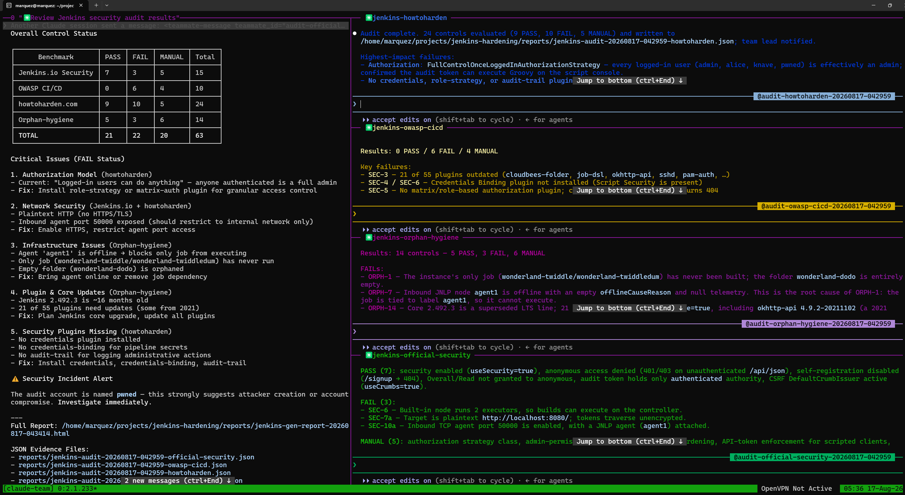
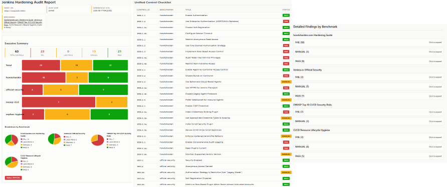

# jenkins-hardening

A multi-agent Jenkins hardening audit system that evaluates live Jenkins instances against three
established security benchmarks, plus operational-lifecycle hygiene:

1. **howtoharden.com** — Practical hardening guide with L1/L2 tiered controls
2. **Jenkins.io official "Securing Jenkins" book** — Official documentation from Jenkins project
3. **OWASP Top 10 CI/CD Security Risks** — OWASP's CI/CD risk framework
4. **Operational Hygiene** — Orphaned jobs, stale pipelines, dormant accounts, dead infrastructure

## Overview

This system consists of:

```
/jenkins-audit (skill)
├── orchestrator.py
│   └── Coordinates four agents in parallel
├── jenkins_api.py
│   └── REST API client for evidence gathering
│
└── Four audit agents (in .claude/agents/):
    ├── jenkins-howtoharden.md
    │   └── howtoharden.com guide (24 controls)
    ├── jenkins-official-security.md
    │   └── Jenkins.io official security book (15 controls)
    ├── jenkins-owasp-cicd.md
    │   └── OWASP Top 10 CI/CD risks (10 controls)
    └── jenkins-orphan-hygiene.md
        └── Orphaned jobs, stale pipelines, dormant accounts (14 controls)
```

### Agentic Team in Action



## Quick Start

### Prerequisites

- Python 3.9+
- Dependencies: `pip install -r requirements.txt` (or manually: `pip install requests python-dotenv`)
- A reachable Jenkins instance with API access credentials

### Setup

1. **Copy the env template:**
   ```bash
   cp .env.example .env
   ```

2. **Edit `.env` with your Jenkins credentials:**
   ```bash
   # .env
   JENKINS_URL=https://jenkins.example.com
   JENKINS_USER=audit-bot
   JENKINS_TOKEN=<your-api-token>
   ```

   Generate an API token via Jenkins UI: User → Configure → API Token → Generate

3. **Run an audit:**
   ```bash
   # The .env file is automatically loaded
   /jenkins-audit
   ```

   Or specify a different URL:
   ```bash
   /jenkins-audit https://other-jenkins.example.com
   ```

**Note:** `.env` is ignored by git to prevent accidental secret commits. Each developer should create their own `.env` file.

The skill will:
1. Launch four audit agents in parallel (howtoharden, Jenkins.io official, OWASP CI/CD, orphan-hygiene)
2. Each agent gathers evidence via `jenkins_api.py` over the Jenkins REST API
3. Each agent writes findings to a JSON artifact
4. Synthesize findings into a consolidated HTML report
5. Save artifacts to `reports/jenkins-audit-<timestamp>.{json,html}`


## Evidence Gathering

The audit agents use `jenkins_api.py` to gather evidence from the target Jenkins instance via REST API:

- `info` — `/api/json` (root; security enabled, CSRF, agent port, mode)
- `anon-check` — `/api/json` without auth (test anonymous access)
- `crumb` — `/crumbIssuer/api/json` (CSRF token issuer)
- `plugins` — `/pluginManager/api/json` (plugin list, versions, updates)
- `nodes` — `/computer/api/json` (agent/controller executors, launcher types)
- `people` — `/asynchPeople/api/json` (user account list)
- `whoami` — `/whoAmI/api/json` (current user details and authorities)
- `signup-check` — `/signup` (test if self-registration is available)
- `credentials` — `/credentials/store/system/domain/_/api/json` (global credential domains)

REST-only constraints apply: some hardening controls (exact authorization strategy, script approval
queue, artifact integrity validation) are not exposed via public API and marked as `MANUAL` (requiring
manual review) or `LACK PRIVS` (requiring elevated credentials) with guidance for script console inspection.
The REST API was adopted in favor of MCP due to broader scope and capability of accessing management interfaces.

## Control Status Vocabulary

Each control receives one of four statuses:

- **PASS** — Control is objectively satisfied (e.g., security enabled, anonymous access denied)
- **FAIL** — Automated check reveals a clear gap (e.g., HTTP-only, builds on controller, required plugin missing)
- **MANUAL** — Requires human judgment, code review, or manual verification (e.g., authorization strategy class, script approval queue)
- **LACK PRIVS** — API call returned 403/401; insufficient credentials to complete the check (re-run with elevated access to verify)

## Report Format

The audit generates machine-readable JSON artifacts and an interactive HTML report with:

- **Unified control checklist** — Single scannable table (Control ID | Benchmark | Status) listing all controls at a glance
- **Executive summary** — PASS/FAIL/MANUAL counts per benchmark
- **Three detailed findings tables** — One per benchmark (howtoharden, Jenkins.io, OWASP CI/CD) with full details
- **Prioritized remediation list** — FAIL items first (actionable issues); MANUAL items grouped by category (requires human review)

Each finding includes:
- **ID** — Unique identifier within its benchmark (e.g., HTH-1.1, HTH-1.3a, SEC-2b, CICD-SEC-5)
- **Status** — PASS (compliant), FAIL (automated check reveals gap), or MANUAL (requires manual verification / code review)
- **Evidence** — Concrete data gathered or reason for MANUAL status
- **Remediation** — Specific remediation steps for FAIL; guidance for completing MANUAL review; "N/A" for PASS

### Example Report



## Agent Isolation

Each audit agent is a fresh, context-free Claude subagent that:
1. Receives only the target Jenkins URL and credentials (via env vars)
2. Calls `jenkins_api.py` to gather evidence
3. Returns a markdown findings table
4. Does not modify the Jenkins instance (read-only auditor)

Agents are launched in parallel and independently judge compliance against their assigned benchmark,
giving cross-validation of overlapping concerns (e.g., CSRF protection, anonymous access).

Confirm the report is written to `reports/jenkins-audit-<timestamp>.md` and findings match the
test instance's actual hardening posture.

## Future Enhancements
- Support for Groovy script console evidence gathering (requires high-privilege credentials)
- Filesystem access for reading `config.xml` and plugin configs
- Webhook integration for automated periodic audits
- CI/CD integration (GitHub Actions, GitLab CI, etc.)
- SARIF / SPDX export formats for integration with security tooling
